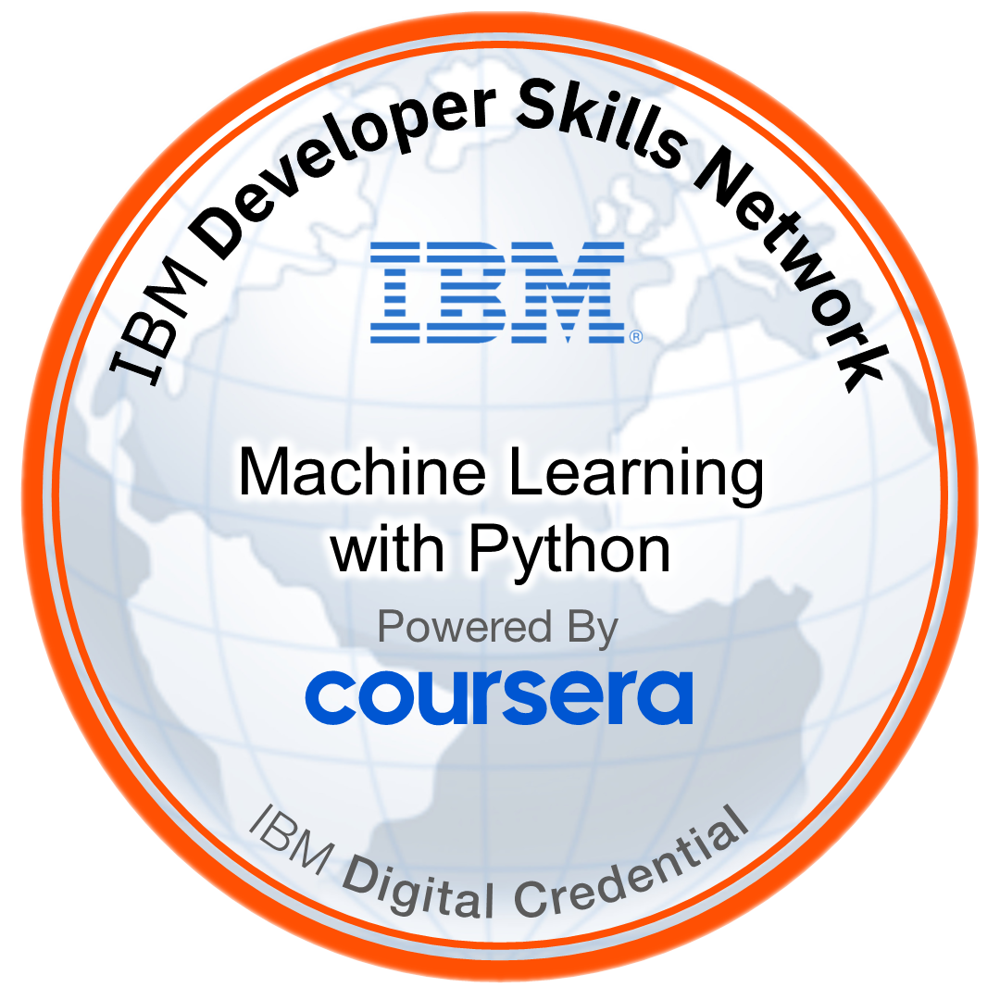
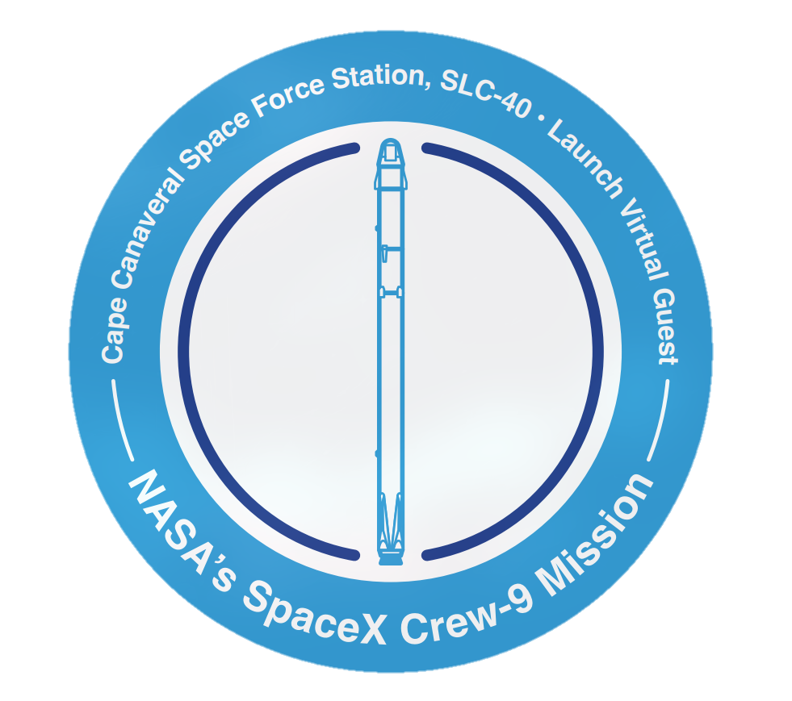
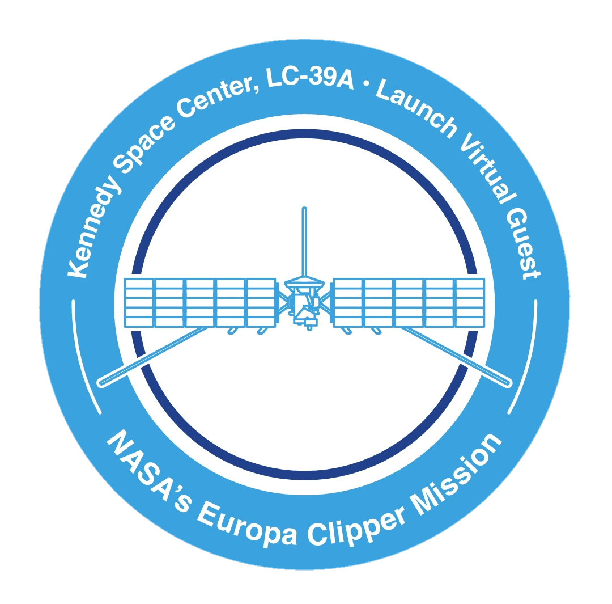

<!--   -->

###

# 💫"To infinity and beyond!" 
<!-- [](https://visitcount.itsvg.in) -->

🌌 Code Voyager | 👨‍💻 Passionate Programmer | 🚀 Space Enthusiast

<!-- -🔭 I’m currently working on new project called **"[Memoir](https://github.com/MemoirApplication/Memoir-App)"** -->

🌱 Currently learning

- **Rust, Keras, PyTorch, TensorFlow**
- **IBM AI Engineering Specialization**
- **Meta Back-End Developer Specialization**

-📫 Reach me **<albaraa.as.2002@gmail.com>**

 [](https://reddit.com/user/chikobara) [](https://stackoverflow.com/users/17065744/chikobara)

###

<a href="https://www.credly.com/badges/8f9dc32a-dc2d-481d-9487-371d32b836ea/public_url">
  
</a>


<a href="https://www.credly.com/badges/20535e30-56e7-4e2a-b117-38ef2a0c8ee3/public_url">
  
</a>

<a href="https://aasxhp5ab.cc.rs6.net/tn.jsp?f=001_ZhrWlqH8niCr3GOqkquq_1EHL2RrX7mf4wmiPVtEb_LUfXcIRZfxCFFDii7dqUdUYnFeULaCTRJb8Ye4mWomZ0289hHxUdNvj6tWkaKQQPaZZwKjHdU_XHlBQe6SZq4yG640xxZNlSlkbg1HKBUeHfX7HTFGvFniV6v-cgakAJZBYT0JrvkAWgHW0rDWrZOeKs5Mu7wR30T8a8j1TfrTS6m5WSwhIvrHv1liLJjVdlKc87V2z2EkYgH8IReeufs&c=7iMYYO1aR8iIVjBUuQ6SkM1qzkGw5jWW1NnmbICcaIS4vg6pGWmOPg==&ch=AJ_JXeaNmZgdFoEDdjY4xZQEsTk6iCs0Ye2kaa_x2JQcK9AO0hzh7Q==">
  
</a>

<a href="https://aasxhp5ab.cc.rs6.net/tn.jsp?f=001aiyQtqzYNMVfv5bSD4rj33ZCmAvsRDmhR71FaIqflkTsV0jDA6-g6aEn_uvj5QcWT0DzsdHutJRTNG-cfMKUjd4Si1PKvEkRr7hO5SKhbNf_CPLb1G30cF43l1fCzWjmj5Wlq3HpjPJFl6ALaK6E6QyyUZBU0YiT8HyD1dppsCN4L2PLtxNIvF-D5RhZztEmv1GDfwxIjH7nEunl0m7jkOkybjPUT_GLo8ZaZ2HLkEkfzb6egS2yHIFWM-bDV9HN&c=UbM5o7aPCPpfSmUyB14zRbK19l0DG_pS_ZE1D74V0t8XreirP1fqNg==&ch=TmbeplMOCLmuM-qpqNjLg3HzgENgawMjP54wltFL4W6KNkDTxsi6uQ==">
</a>

<br><br>

###

# 📊 Wakatime Stats [](https://wakatime.com/@0f89afa4-1089-41cd-81da-b5f372408386)

### Weekly statistics

<!--START_SECTION:waka-->

```txt
Other          39 hrs 53 mins  ███████████████████▓░░░░░   78.61 %
Python         6 hrs 22 mins   ███░░░░░░░░░░░░░░░░░░░░░░   12.57 %
Bash           1 hr 25 mins    ▓░░░░░░░░░░░░░░░░░░░░░░░░   02.82 %
Dart           1 hr 22 mins    ▓░░░░░░░░░░░░░░░░░░░░░░░░   02.72 %
INI            30 mins         ▒░░░░░░░░░░░░░░░░░░░░░░░░   00.99 %
```

<!--END_SECTION:waka-->

###

# 📊 GitHub Stats


